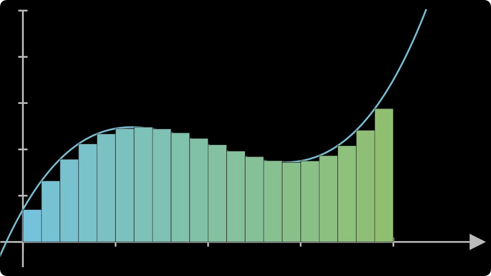
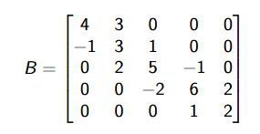
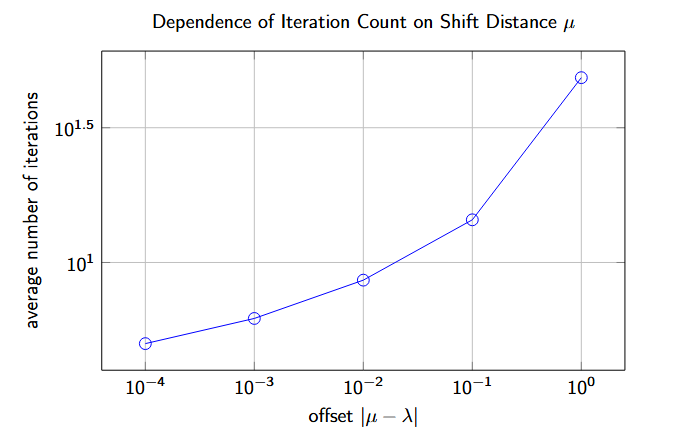

# Applied Numerical Methods in MATLAB

This repository contains academic projects developed for a university course in Numerical Methods using MATLAB. The focus of the projects is on efficient numerical computation, stability, and implementation of classical algorithms in scientific computing.

---

# Project 1 — Numerical Integration over a Circular Domain

## Problem Description

The goal of this project was to compute the double integral

$\iint_D f(x,y)\,dx\,dy$,

where the integration domain is defined by

$D = \{(x,y) \in \mathbb{R}^2 : x^2 + y^2 \leq 1\}$.

Since the domain is non-rectangular, direct application of standard quadrature rules is not possible.

---

## Mathematical Formulation

A coordinate transformation was introduced:

$(x,y) = T(u,v), \quad (u,v) \in [-1,1]^2.$

After substitution, the integral becomes:

$\iint_D f(x,y)\,dx\,dy =
\iint_{[-1,1]^2} f(T(u,v)) \cdot |J(u,v)| \,du\,dv,$

where $J(u,v)$ is the Jacobian determinant of the transformation.

This reduces the problem to integration over a square domain.

---

## Numerical Methods

The following methods were applied:

- Square-to-disk coordinate transformation
- Jacobian-based variable substitution
- Composite two-point Gauss–Legendre quadrature
- Two-dimensional numerical integration
- Vectorized function evaluation

The Gauss–Legendre rule was applied independently in both directions.

---

## Testing

Selected validation tests included:

1. Polynomial functions with known analytical integrals  
2. Trigonometric functions such as $f(x,y)=\sin(x)\cos(y)$  
3. Radially symmetric functions $f(x,y)=g(x^2+y^2)$  

Convergence was verified by increasing the number of subintervals.

---

## Result

The implemented method successfully produced accurate and stable numerical approximations of integrals over circular domains.

---

# Project 2 — Inverse Power Method for Tridiagonal Matrices

## Problem Description

This project focused on computing eigenvalues of large tridiagonal matrices using the shifted inverse power method.

Given a matrix

$A \in \mathbb{R}^{n\times n}$,

the objective was to determine the eigenvalue closest to a given shift parameter $\mu$.

The main constraints were:

- $1 \leq n \leq 200\,000$
- No use of sparse matrix utilities
- Limited memory usage
- High computational efficiency

---

## Mathematical Formulation

The shifted inverse iteration is defined by:

$(A - \mu I) y_k = x_k,$  
$x_{k+1} = \dfrac{y_k}{\|y_k\|}.$

Under suitable conditions, the sequence $\{x_k\}$ converges to the eigenvector corresponding to the eigenvalue closest to $\mu$.

The eigenvalue is approximated using the Rayleigh quotient:

$\lambda_k = x_k^T A x_k.$

---

## QR Decomposition Using Householder Reflections

To solve systems of the form

$(A - \mu I)y = x$,

a QR decomposition was computed:

$A - \mu I = QR.$

Householder reflections were implemented manually:

$H = I - \beta vv^T,$

where $v$ is the reflection vector and $\beta$ is a scalar coefficient.

Because $A$ is tridiagonal, the resulting $R$ matrix is banded and stored using three diagonals.

This significantly reduces memory usage.

---

## Solving Linear Systems

After QR decomposition, systems were solved in two steps:

1. Application of $Q^T$ to the right-hand side  
2. Backward substitution for the banded matrix $R$

This allowed solving each system in $O(n)$ time.

---

## Inverse Iteration Scheme

The full iteration procedure consists of:

1. Initial random vector $x_0$  
2. Solution of $(A-\mu I)y_k = x_k$  
3. Normalization $x_{k+1} = y_k/\|y_k\|$  
4. Rayleigh quotient evaluation  
5. Convergence test

The QR decomposition is computed only once and reused.

---

## Adaptive Shift Update

In addition to fixed-shift iteration, a dynamic shift strategy was implemented.

After each iteration, the shift is updated as:

$\mu_{k+1} = x_k^T A x_k.$

This corresponds to Rayleigh quotient iteration and improves convergence speed.

The adaptive scheme follows:

$\mu_{k+1} = \lambda_k,$  
$(A - \mu_{k+1} I)y_{k+1} = x_{k+1}.$

This method achieves faster local convergence near eigenvalues.

**Table**

The table below compares the total computation time of the inverse iteration method using a fixed shift parameter $\mu$ and an adaptively updated shift based on the Rayleigh quotient.

| $\delta$  | Fixed $\mu$ Time [s] | Adaptive $\mu$ Time [s] | Relative Gain | Winner |
| --------- | -------------------- | ----------------------- | ------------- | ------ |
| $10^{-4}$ | 0.0629               | 0.0692                  | -0.100        | Fixed  |
| $10^{-5}$ | 0.0217               | 0.0458                  | -1.113        | Fixed  |
| $10^{-6}$ | 0.0172               | 0.0394                  | -1.290        | Fixed  |

---

## Numerical Tests

Representative tests included:

1. Random tridiagonal matrices with known spectra  
2. Matrices with isolated dominant eigenvalues  
3. Large-scale matrices with $n > 10^5$  
4. Nearly singular shifted matrices  
5. Matrices with clustered eigenvalues  

## Numerical Stability Tests

Additional stability checks were performed:

1. Monitoring $\|A x_k - \lambda_k x_k\|$  
2. Sensitivity to small perturbations in $\mu$  
3. Conditioning of $(A-\mu I)$  
4. Detection of near-singular cases  

---

## Result

The algorithm reliably computed accurate eigenvalues for large-scale tridiagonal matrices within the imposed performance constraints.

---

# Warm-up Workshop — Nonlinear Root Finding

## Problem Description

The objective was to implement a function

$r = \texttt{nlin}(f)$

that finds all real roots of a continuous function $f(x)$ without using built-in solvers.

## Numerical Method

The solution was based on:

- Global scanning of the real axis
- Detection of sign changes
- Bisection refinement
- Duplicate filtering using machine precision

The bisection method guarantees convergence for simple roots.

---

## Testing

Selected tests included:

1. Functions with multiple separated roots  
2. Oscillatory functions  
3. Functions with clustered roots  

---

## Result

The implemented procedure successfully detected and refined real roots for a wide range of test functions.

